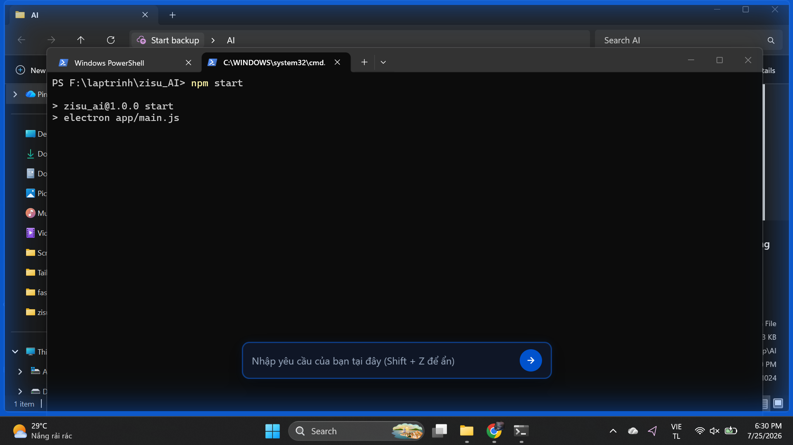
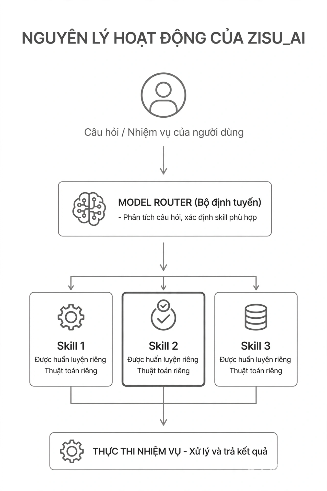

# zisu AI - Open Source AI Agent Desktop System

zisu AI là một hệ thống AI Agent siêu nhẹ chạy hoàn toàn dưới máy cục bộ (Local CPU), được thiết kế để điều khiển máy tính thông qua các kỹ năng (Skills) và bộ định tuyến (Router) tự huấn luyện. Dự án giúp tự động hóa các tác vụ máy tính mà không cần gửi dữ liệu lên đám mây hoặc phụ thuộc vào các mô hình ngôn ngữ lớn (LLM) đắt đỏ.

---

## 🚀 Tính năng cốt lõi

Hệ thống hiện tại hỗ trợ 4 kỹ năng cơ bản được phân loại theo mức độ phức tạp và rủi ro:
1. **`open_app`** (Level 1: Rule + Fuzzy Match): Tự động tìm kiếm và khởi chạy ứng dụng hệ thống hoặc ứng dụng bên thứ ba.
2. **`create_file`** (Level 2: Regex + ML Extractor): Tạo tập tin mới với tên tệp, thư mục đích và nội dung tùy ý.
3. **`create_directory`** (Level 2: Regex): Tạo thư mục mới tại đường dẫn chỉ định.
4. **`delete_file_or_dir`** (Level 2: Regex - High Risk): Xóa tệp tin hoặc thư mục (yêu cầu xác nhận từ người dùng trước khi thực thi).

---

## 🧠 Nguyên lý hoạt động của AI (AI Working Principles)

Hệ thống hoạt động theo mô hình xử lý ngôn ngữ tự nhiên (NLP) lai ghép (Hybrid NLP Pipeline) trực quan hóa dưới đây:



### Chi tiết luồng xử lý:

1. **Phân tách Mệnh đề (Clause Splitting)**
   - Yêu cầu dạng câu ghép của người dùng (Ví dụ: *"mở chrome rồi sau đó tạo file test.txt"*) sẽ được bộ tách mệnh đề (`split_clauses.py`) phân rã thành các câu đơn độc lập nhờ vào hệ thống nhận diện từ nối như `rồi`, `sau đó`, `và`, `tiếp theo`.
   
2. **Định tuyến Ý định (Intent Routing)**
   - Mỗi mệnh đề đơn được chuyển tới mô hình phân loại **Logistic Regression** kết hợp bộ trích xuất đặc trưng **TF-IDF (Word & Bigram)**. 
   - Mô hình này được huấn luyện local thông qua dữ liệu mẫu để dự đoán chính xác Skill nào sẽ chịu trách nhiệm xử lý mệnh đề đó (độ tin cậy > 0.5).

3. **Trích xuất Tham số Lai ghép (Hybrid Parameter Extraction)**
   - **Level 1 (Rule-based & RapidFuzz):** Dùng đối đối khớp cứng hoặc tìm kiếm mờ (Fuzzy Matching) để trích xuất nhanh thông tin tĩnh (như tên ứng dụng).
   - **Level 2 (Regex & ML Sequence Tagging):** Sử dụng các biểu thức chính quy (Regular Expressions) song song với một mô hình **Sequence Classifier (BIO Tagging)** tự huấn luyện để dán nhãn các thực thể (Token-level labeling: `B-param`, `I-param`). Ví dụ: Xác định chính xác đâu là `file_name`, `path` hoặc `content` trong câu lệnh.

4. **Lập Kế hoạch & Thực thi (Plan & Execution)**
   - Hệ thống tổng hợp các mệnh đề và tham số thành một bản kế hoạch thực thi tuần tự (**Execution Plan**).
   - **Local Executor** sẽ tuần tự gọi API hệ điều hành để hoàn thành các tác vụ và ghi nhận phản hồi (Feedback) của người dùng để cải thiện độ chính xác cho các lần chạy sau.

### Tóm tắt dễ hiểu nhất:
**Nguyên lý hoạt động:**
- Train một model đóng vai trò router, có nhiệm vụ phân tích câu hỏi của người dùng và xác định nên gọi skill nào phù hợp.
- Sau khi router chọn được skill, bản thân skill đó cũng được xây dựng thông qua training hoặc một thuật toán riêng để thực hiện tác vụ cụ thể.
---

## 💻 Hướng dẫn Cài đặt & Chạy thử nghiệm

### 1. Yêu cầu hệ thống
* **Python 3.12+**
* **Node.js v22+**
* Hệ điều hành hỗ trợ tốt nhất: **Windows**

### 2. Clone Dự án từ GitHub
Mở terminal và chạy các lệnh sau để clone repository về máy:
```bash
git clone https://github.com/Tuan3d/Zisu_AI.git
cd Zisu_AI
```

### 3. Cài đặt Thư viện cần thiết
**Cài đặt các thư viện Python cho Backend:**
```bash
pip install scikit-learn rapidfuzz numpy flask flask-cors pandas
```

**Cài đặt các thư viện Node (Electron) cho Desktop App:**
```bash
npm install
```

### 4. Khởi chạy ứng dụng

Dự án cần chạy song song cả Python Server (xử lý AI) và Client App (giao diện Electron):

* **Bước 1: Khởi động Python Server Backend**
  ```bash
  python server.py
  ```
  *(Server sẽ tự động train lại Router Model và lắng nghe tại cổng `http://127.0.0.1:5000`)*

* **Bước 2: Khởi động Giao diện Desktop Overlay**
  ```bash
  npm start
  ```

* **Bước 3: Tương tác với AI Agent**
  - Nhấn tổ hợp phím **`Shift + Z`** trên bàn phím để bật/ẩn khung chat overlay ở góc màn hình.
  - Nhập câu lệnh của bạn và nhấn Enter. Ví dụ:
    * `mở chrome rồi sau đó tạo file test.txt ở Document`
    * `tạo thư mục project ở D:/work rồi mở ứng dụng notepad`

* **Bước 4: Quản lý & Huấn luyện (Admin Dashboard)**
  ```bash
  npm run admin
  ```
  *(Mở giao diện quản trị giúp bạn thêm skill mới, viết test case, và bấm Train trực tiếp trên UI)*

---

## 🛠️ Cấu trúc thư mục dự án
* `/core`: Chứa logic cốt lõi của Agent (Executor, Plan Builder, ML Extractor).
* `/router`: Chứa mã nguồn huấn luyện mô hình phân loại câu lệnh và dữ liệu huấn luyện.
* `/skills`: Định nghĩa các kỹ năng (schema, extractor, test cases).
* `/app`: Mã nguồn giao diện chính Electron (Overlay client).
* `/admin`: Mã nguồn giao diện quản trị Admin Dashboard.

## 📄 Giấy phép (**MIT**)
